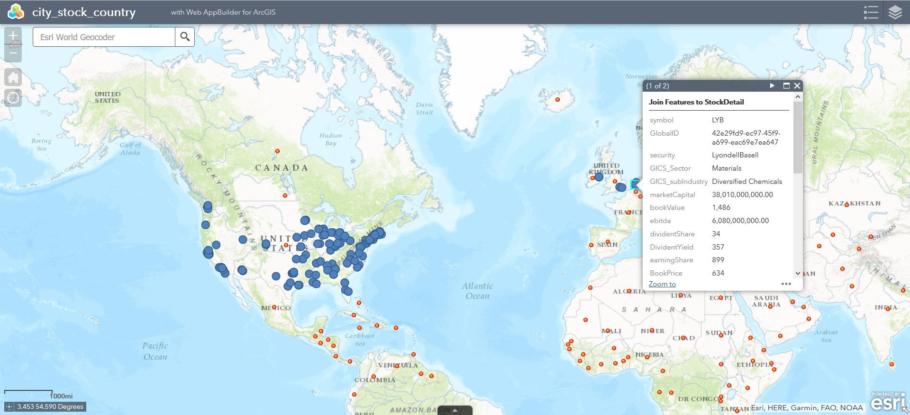
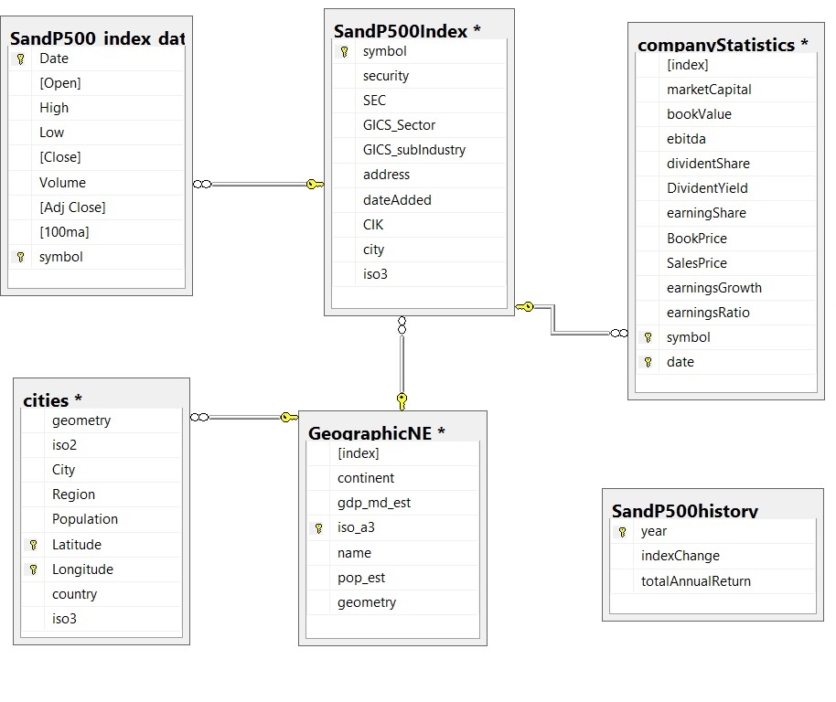

S&P 500
=======
The map produced as the result is available at:

- https://nedlaw.maps.arcgis.com/apps/webappviewer/index.html?id=15677178af9a4808961d957cc21064d3

The map features countries and companies as separate features. 
The solution is divided to scripts and additional source files divided to three modules:

- ./data/complex (Math module) see complex.ipynb
- ./data/finance (Data objects) see finance- and finance_main.ipymb
- ./data/geographic (Map) see geographic.ipymb

Linked database design and queries
----------------------------------
The information used is collected through different REST services. Each service type is linked with table (table = service call).

- SandP500Index and CompanyStatistics tables share the [Symbol] as ID.
- SandP500_index_data tables contains the running record of company performance. 
- SandP500history table is the running benchmark
- GeographicNE and cities tables contain the geographic information needed to link location to company. 

SQL 

  SELECT [Date] ,[Volume] ,[Adj Close] ,[100ma] ,stati.[symbol],[Latitude] ,[Longitude], s.City
  
  FROM [finance].[dbo].[SandP500_index_data] as stati INNER JOIN 
       (SELECT top 10  [symbol], [Latitude] ,[Longitude], cities.City
        FROM [finance].[dbo].[SandP500Index] as comp left join [finance].[dbo].[cities] 
            on cities.City = comp.city and cities.iso3 = comp.iso3 
            inner join [finance].[dbo].[GeographicNE] as country on cities.iso3 = country.iso_a3
        where cities.iso3 is not null
        order by comp.symbol) 
  s on s.symbol = stati.symbol
  
  where DATEDIFF(day,[Date],getdate()) between 0 and 170 
  
  order by stati.symbol, [Date]

Query using SQL alchemy - parameter name notation - :gigs 
 
  SELECT c_index.[symbol], [security],[SEC], [GICS_Sector], [GICS_subIndustry],[CIK],[marketCapital]
                          ,[bookValue], [ebitda], [dividentShare], [DividentYield], [earningShare], [BookPrice]
                          ,[SalesPrice], [earningsGrowth], [earningsRatio]
                          ,substring(address, CHARINDEX(', ', address)+1, len(address)-(CHARINDEX(', ', address)-1)) as US_state
  FROM [finance].[dbo].[SandP500Index] as c_index
                inner join [finance].[dbo].[companyStatistics] as stat on c_index.symbol = stat.symbol
  where [GICS_Sector] like :gigs

Python SQL to ARCGIS development
================================

this project tests Python as a mediator technology between SQL data-store and an existing front-end UI called ARCGIS. 
As an UI platform, ARCGIS ( https://developers.arcgis.com/ ) is developer-friendly.

To discover the links between source and documentation, database and thin-client UI, and programming practices and available libraries.
The development platform used is Python 3.5.
Task specific packages include:

- geoalchemy2 
- geopandas   
- pandasql   
- sqlalchemy  

Python to UI:

- html5lib				
- esri arcgis			

problems to solve
-----------------
- Acquiring and redefining static and updating data.
- Authentication and access to SQL and ARCGIS 
- Importing and exporting data from the ARCGIS platform. 
- Visualization 

Opinions about Python
=====================

As development platform Python has mixed identity - it can be used to: 

- supplement command prompt 
- scripting
- larger programming.
 
It is designed as modular tool with programmable objects at core.
E.g. In this project, the main access is done with using scripts, but the core is done using the objects. 

